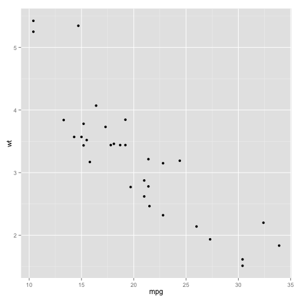

Test presentation
========================================================
author: Petr Bouchal
font-import: http://fonts.googleapis.com/css?family=Source Sans Pro
# font-family: 'New Cicle'
transition: zoom
transition-speed: slow

First Slide
========================================================
type: normal
incremental: true

For more details on authoring R presentations click the
**Help** button on the toolbar.

- Bullet 1
- Bullet 2
- Bullet 3

Slide With Code
========================================================


```r
summary(cars)
```

```
     speed           dist    
 Min.   : 4.0   Min.   :  2  
 1st Qu.:12.0   1st Qu.: 26  
 Median :15.0   Median : 36  
 Mean   :15.4   Mean   : 43  
 3rd Qu.:19.0   3rd Qu.: 56  
 Max.   :25.0   Max.   :120  
```

Slide With Plot
========================================================

 

Slide with table
====================
### Example Simple Markdown Table
Observation | Variable1 | Variable2
:---------- | :-------: | :-------:
Subject1 | a | b

There were 50 cars studied
